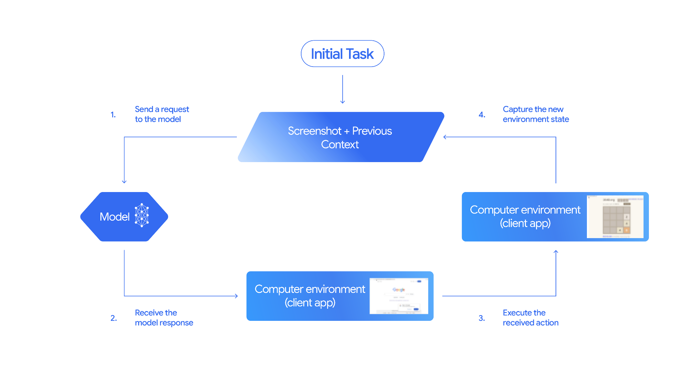

# Enterprise Web Automation Framework

A production-grade, agentic web automation framework powered by **Gemini 2.5 Computer Use Model**. It features intelligent fallback analysis, natural language task execution, advanced anti-bot detection bypass, industrial standards, and an enterprise-level architecture.

## 🌟 Key Features

- **🤖 LLM-Powered Agent (Gemini 2.5 Computer Use Model)**: Execute complex web automation tasks simply by providing a natural language prompt. Read more about the model: [Gemini Computer Use Model](https://blog.google/innovation-and-ai/models-and-research/google-deepmind/gemini-computer-use-model/)
- **🌐 Universal Website Support**: Out-of-the-box workflows for Amazon, YouTube, MakeMyTrip, Yahoo Finance, GitHub, Booking, Flipkart, Alibaba, plus a generic fallback engine to handle **any** custom website dynamically.
- **🛡️ Anti-Bot & Stealth Mode**: Advanced bypass techniques including user-agent rotation, header randomization, realistic human typing, and random action delays to evade bot detection.
- **🔄 Intelligent Fallback**: Dynamically switches to intelligent DOM-based UI analysis and interaction when standard workflow steps fail or encounter unexpected site changes.
- **⚙️ Enterprise Architecture**: Built with robust configuration management (Pydantic), structured logging (Structlog), database persistence (SQLAlchemy), and retry logic with exponential backoff.
- **💻 Multi-Browser Support**: Integrated with Playwright and Selenium (`undetected-chromedriver`) for maximum flexibility and stealth.



## 🛠️ Technologies Used

### Backend
- **AI/LLM Engine**: Google Generative AI (`google-generativeai`)
- **Browser Automation**: Playwright, Selenium (`undetected-chromedriver`)
- **API Framework**: FastAPI with WebSockets for real-time updates
- **Configuration**: Pydantic v2, `python-dotenv`
- **Database / Persistence**: SQLAlchemy
- **Language**: Python 3.8+
- **Logging**: structlog, python-json-logger

### Frontend
- **Framework**: React 19 (Vite, TypeScript)
- **Routing**: React Router 7
- **Data Visualization**: Recharts
- **Icons**: Lucide React
- **Date Utilities**: date-fns

## 🖥️ Frontend Dashboard Features

The framework includes a state-of-the-art monitoring dashboard designed for enterprise observability:

- **📊 Real-time Analytics**: High-level KPI cards tracking success rates, average execution times, and total automation actions across all tasks.
- **📈 Performance Visualization**: Interactive area charts and pie charts providing insights into execution trends and status distributions.
- **⏱️ Live Log Streaming**: Real-time monitoring of agentic processes via WebSockets, allowing you to see exactly what the AI is doing as it happens.
- **🗂️ Task History & Management**: A comprehensive database of all past executions, complete with status tracking, duration metrics, and direct links to task details.
- **🔍 Deep Task Inspection**: Detailed views for every automation run, capturing critical metadata, prompts, and final outcomes.
- **✨ Premium UI/UX**: A modern, responsive interface featuring a sleek dark mode, glassmorphism design elements, and interactive data components.

## 🚀 Installation & Setup

Follow these detailed steps to get the Enterprise Web Automation Framework up and running on your system.

### 🐍 Backend Setup (Terminal & API)

1.  **Open Terminal**: Open your command prompt (CMD), PowerShell, or terminal in the project's root directory.
2.  **Create Virtual Environment**:
    ```batch
    python -m venv venv
    ```
3.  **Activate Virtual Environment**:
    - **Windows**: `venv\Scripts\activate`
    - **macOS/Linux**: `source venv/bin/activate`
4.  **Install Python Dependencies**:
    ```batch
    pip install -r requirements.txt
    ```
5.  **Configure Environment Variables**:
    - Create a `.env` file: `copy .env.example .env` (Windows) or `cp .env.example .env` (macOS/Linux).
    - Open `.env` and add your `GEMINI_API_KEY`.
    - (Optional) Set `HEADLESS=False` in `.env` to watch the browser interactions live.
6.  **Run the Application**:
    - **Interactive Menu**: `python main.py` (Best for direct control).
    - **API Server**: `python run_dashboard.py` (Required for the Frontend Dashboard).

---

### 💻 Frontend Setup (Monitoring Dashboard)

1.  **Open a New Terminal**: Navigate to the `frontend` directory: `cd frontend`.
2.  **Install Node Dependencies**: Ensure [Node.js](https://nodejs.org/) is installed, then run:
    ```batch
    npm install
    ```
3.  **Start Development Server**:
    ```batch
    npm run dev
    ```
4.  **Access Dashboard**: Open `http://localhost:5173` in your browser.

---

### ✅ Verification & Testing

- **FastAPI Health**: Visit `http://localhost:8000/docs` to verify the API server is active.
- **Initial Test**: Run `python main.py` and select **Option 1 (Run DemoQA Test)** to ensure the AI agent and browser drivers are correctly configured.

## 🎮 Usage

Upon starting the application through `main.py`, you will be presented with a robust, interactive terminal interface:

```text
======================================================================================================================================================
MAIN MENU - REAL WEBSITE AUTOMATION
======================================================================================================================================================

1. Run DemoQA Test (Learning)
2. Automate Amazon (Search Product)
3. Automate YouTube (Search Videos)
4. Automate Yahoo Finance (Search Stock Prices)
5. Automate MakeMyTrip (Search Flights)
6. Automate Custom Website (User Prompt)
7. View Supported Websites
8. View Settings
9. Exit
```

You can select a pre-defined workflow tailored for specific sites (options 1-5), or select **Option 6** to execute zero-shot custom tasks via natural language, for example:
> *"Go to amazon.com and find iPhone 15 Pro Max price and variants"*

## 🏗️ Project Structure & Context

- `agents/`: Gemini-based task logic, prompt analysis, and agentic computer use integrations.
- `api/`: FastAPI server implementation handling REST endpoints and WebSocket log streaming.
- `chrome/`: Chrome profile management and driver optimization settings.
- `config/`: Centralized Pydantic configuration module parsing the `.env` settings.
- `core/`: The core `AutomationEngine` tying together browser operations and ML agent logic.
- `detectors/`: Modules for detecting page elements and bot-protection mechanisms.
- `frontend/`: React-based dashboard for real-time monitoring and control.
- `handlers/`: Specific interaction handlers for various website components.
- `logging_config/`: Robust JSON/Structlog configuration for enterprise-grade tracing.
- `persistence/`: SQLite/Database storage bindings via SQLAlchemy for task history.
- `selenium_driver/`: Browser instantiation and stealth setups for undetected automation.
- `utils/`: Common utilities for file handling, image processing, and string manipulation.
- `workflows/`: Pre-defined automation routines for target websites (Amazon, YouTube, etc.).
